## Outline

   

1. Five Problems in the Scientific Study of Consciousness
2. Bistable Perception and the Prefrontal Cortex
3. Implications for Computational Psychiatry
4. Outlook and Discussion

## Conscious Experience

 
 
 

Nagel (1975): *"(...) an organism has conscious mental states if and only if there is **something that it is like** to be that organism."* 

# Five Problems {data-background-image="./Content/5_problems.svg" data-background-size="contain" data-background-opacity="0"}

## Subjectivity  {data-transition="fade"}

>- Why does conscious experience occur at all?

## Neural Mechanisms {data-transition="fade"}

- What are the neural events that generate conscious experience?

## Scale {data-transition="fade"}

- What is the scale at which conscious experience emerges from biological activity?

## Function {data-transition="fade"}

- What is the evolutionary function of conscious experience?

## Detection {data-transition="fade"}

- How can we detect conscious experience outside of the human mind?

# Neural Mechanisms {data-background-image="./Content/5_problems_highlight_Boundary.svg" data-background-size="contain" data-background-opacity="0"}

## Where to look for {data-transition="none"}

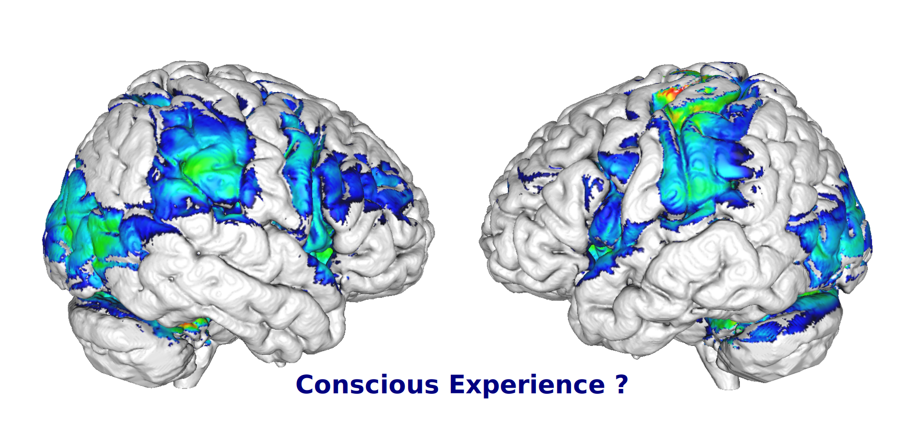

## Where to look for {data-transition="none"}

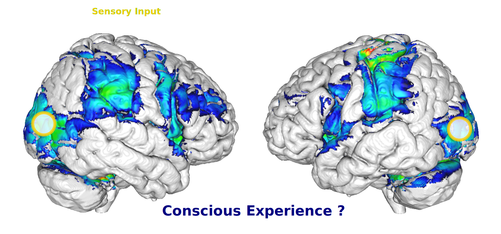

## Where to look for {data-transition="none"}

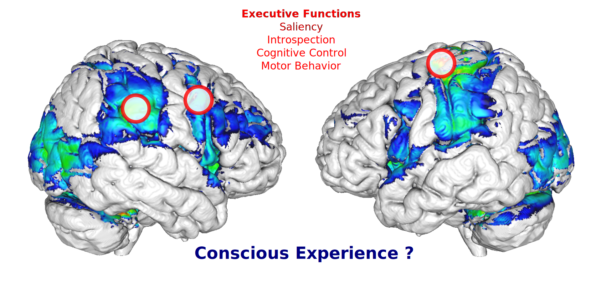

## Where to look for {data-transition="none"}

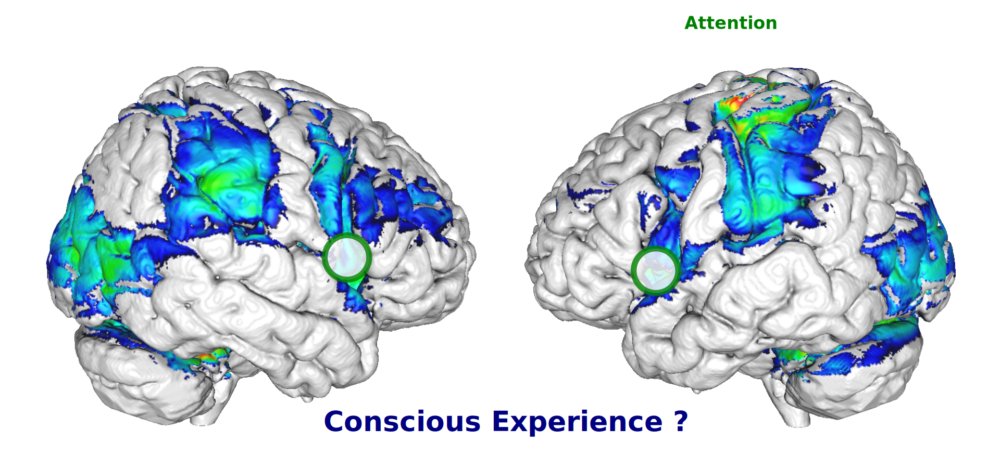

## Where to look for {data-transition="none"}

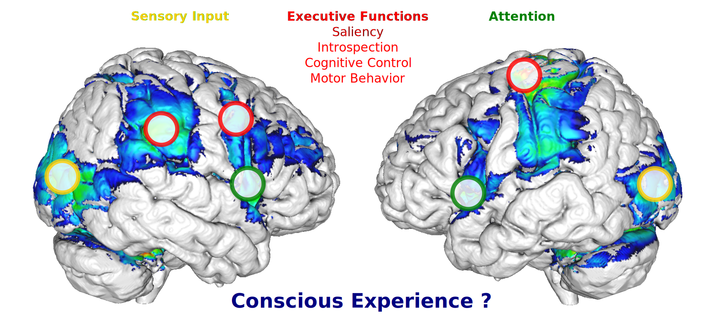

- Experimental dissociation from events occuring up- and downstream of conscious experience

## Bistable Perception {data-background-color="black" background-transition="fade" data-transition="fade"}

<video data-autoplay data-src="./Content/RDK_Ambiguity_immediate.mp4" width="50%" heigth="50%">

## Sensory Ambiguity {data-transition="fade"}

 

## Experimental Dissociation {data-transition="fade"}

 
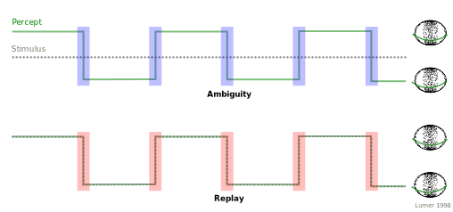

>- Contrast between ambiguous and "replay" transitions

## Ambiguity {data-background-color="black" background-transition="fade" data-transition="fade"}

<video data-autoplay data-src="./Content/RDK_Ambiguity_immediate.mp4" width="50%" heigth="50%">

## Replay {data-background-color="black" background-transition="fade" data-transition="fade"}

<video data-autoplay data-src="./Content/RDK_Replay_immediate.mp4" width="50%" heigth="50%">

# Frontoparietal Cortex {data-background-image="./Content/Meta_Transitions.svg" data-background-size="contain" data-background-opacity="0" data-transition="fade"}

## Feedback Hypothesis {data-background-image="./Content/Meta_Transitions_feedback.svg" data-background-size="contain" data-background-opacity="0" data-transition="none"}

## Feedforward Hypothesis {data-background-image="./Content/Meta_Transitions_feedforward.svg" data-background-size="contain" data-background-opacity="0" data-transition="none"}

## Hybrid Hypothesis {data-background-image="./Content/Meta_Transitions_hybrid.svg" data-background-size="contain" data-background-opacity="0"}

## Predictive Coding {data-background-image="./Content/Meta_background.svg" data-background-size="contain" data-background-opacity="0" data-transition="fade"}

 
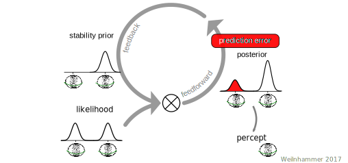

## Predictive Coding {data-background-image="./Content/Meta_background.svg" data-background-size="contain" data-background-opacity="0" data-transition="fade"}

 

## Predictive Coding {data-background-image="./Content/Meta_background.svg" data-background-size="contain" data-background-opacity="0" data-transition="fade"}

 

## Predictive Coding {data-background-image="./Content/Meta_background.svg" data-background-size="contain" data-background-opacity="0" data-transition="fade"}

 
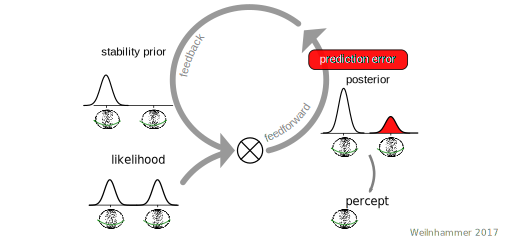

## PE minimisation {data-background-image="./Content/Meta_background.svg" data-background-size="contain" data-background-opacity="0" data-transition="fade"}

 

## PE minimisation {data-background-image="./Content/Meta_background.svg" data-background-size="contain" data-background-opacity="0" data-transition="fade-in slide-out"}

 
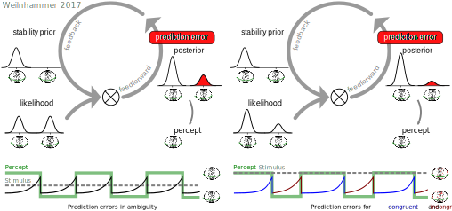

>- Two fMRI experiments in 55 healthy participants

## Model-based fMRI {data-background-image="./Content/Meta_background.svg" data-background-size="contain" data-background-opacity="0" data-transition="fade"}

 
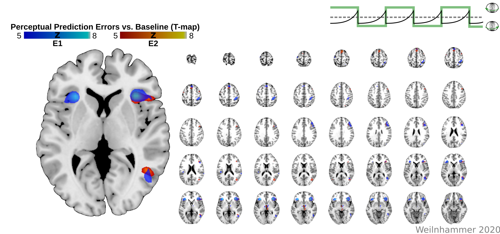

>- IFC and V5/hMT+ represent PEs

## Neural timecourse {data-background-image="./Content/Meta_background.svg" data-background-size="contain" data-background-opacity="0" data-transition="fade"}

 
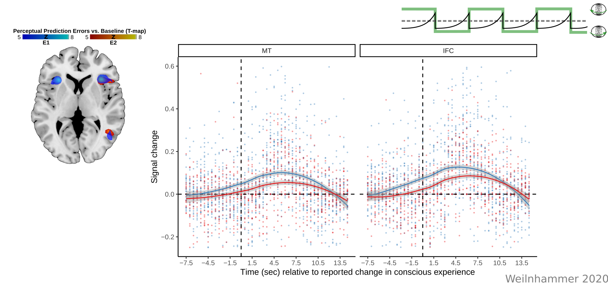

- IFC and V5/hMT+ represent PEs

## Posterior Probability Maps {data-background-image="./Content/Meta_background.svg" data-background-size="contain" data-background-opacity="0" data-transition="fade"}

 
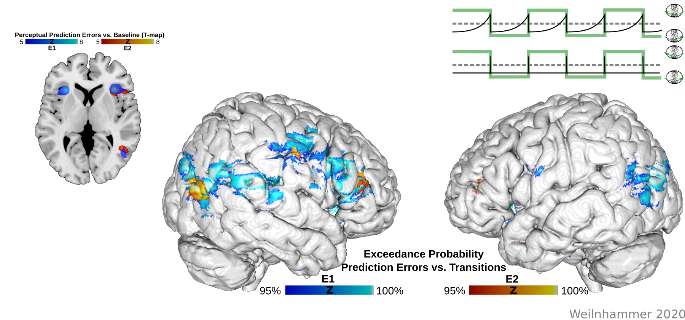

- IFC and V5/hMT+ represent PEs

## Dynamic Causal Modeling {data-background-image="./Content/Meta_background.svg" data-background-size="contain" data-background-opacity="0" data-transition="fade"}

 
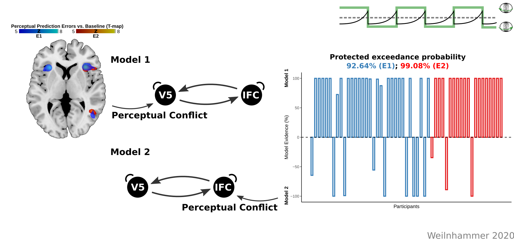

>- PEs are fed forward from V5/hMT+ to IFC

## Decoding {data-background-image="./Content/Meta_background.svg" data-background-size="contain" data-background-opacity="0" data-transition="fade"}

 
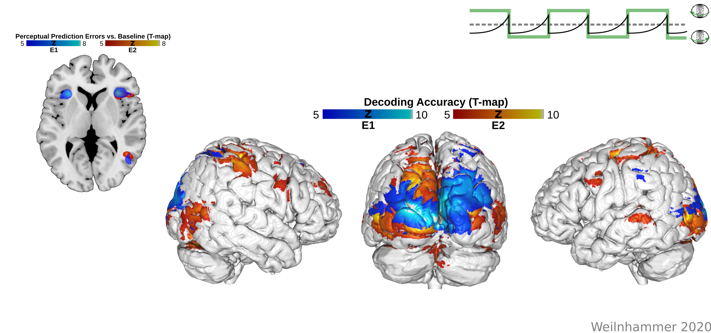

>- Perceptual content can be decoded from V5/hMT+

## Biased voxels in V5/hMT+ {data-background-image="./Content/Meta_background.svg" data-background-size="contain" data-background-opacity="0" data-transition="fade"}

 
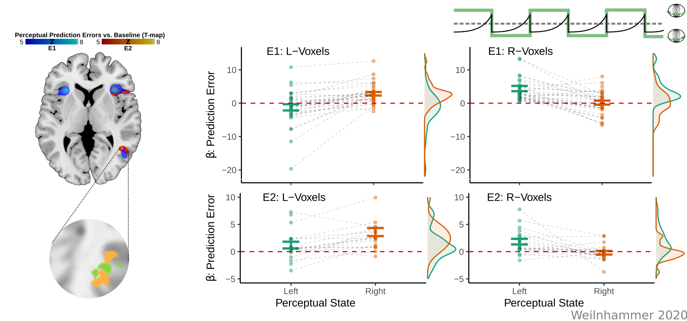

>- Dissociation between perceptual content and PEs. 

## Feedforward Processing {data-background-image="./Content/Meta_Transitions_interim_1.svg" data-background-size="contain" data-background-opacity="0" data-transition="fade"}

# Feedback Processing {data-background-image="./Content/Meta_Transitions_interim_2.svg" data-background-size="contain" data-background-opacity="0" data-transition="slide"}

## Virtual Lesions {data-background-image="./Content/Meta_Transitions_interim_3.svg" data-background-size="contain" data-background-opacity="0" data-transition="fade"}

## Virtual lesions {data-background-image="./Content/Meta_background_stimulation.svg" data-background-size="contain" data-background-opacity="0" data-transition="fade"}

 
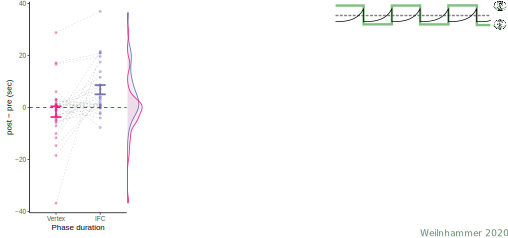

## Virtual lesions {data-background-image="./Content/Meta_background_stimulation.svg" data-background-size="contain" data-background-opacity="0" data-transition="fade"}

 
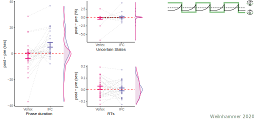

## Virtual lesions {data-background-image="./Content/Meta_background_stimulation.svg" data-background-size="contain" data-background-opacity="0" data-transition="fade"}

 
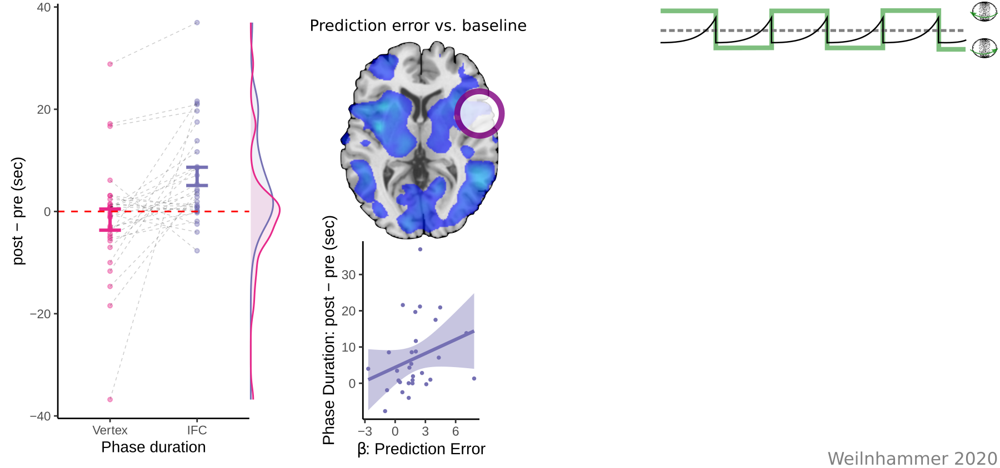

## Virtual lesions {data-background-image="./Content/Meta_background_stimulation.svg" data-background-size="contain" data-background-opacity="0" data-transition="fade"}

 
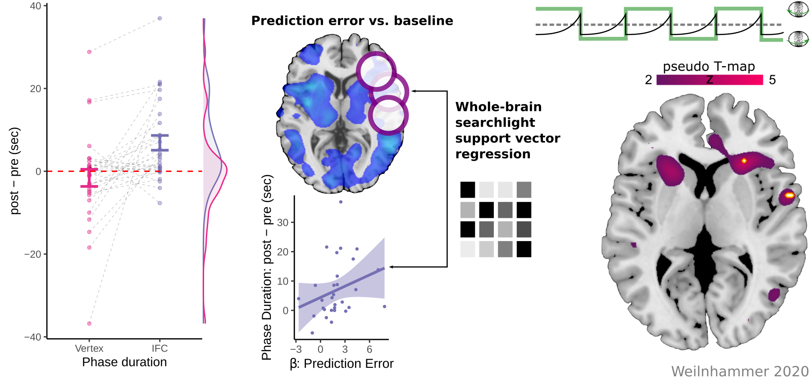

## Feedback Processing {data-background-image="./Content/Meta_Transitions_interim_4.svg" data-background-size="contain" data-background-opacity="0" data-transition="fade"}

# Neural Mechanisms {data-background-image="./Content/5_problems_formulated_boundary.svg" data-background-size="contain" data-background-opacity="0"}

# Computational Psychiatry {data-background-image="./Content/5_problems_formulated_boundary_and_function.svg" data-background-size="contain" data-background-opacity="0"}

## Hollow Mask Illusion {data-background-color="black" data-transition="fade"}

<video loop data-autoplay data-src="./Content/hollowmask.mp4" width="50%">

## Bayesian Models of Psychosis {data-transition="slide-in none-out"}

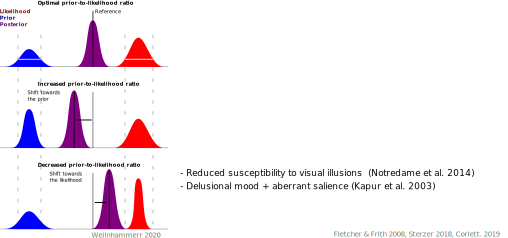

## Bayesian Models of Psychosis {data-transition="fade"}

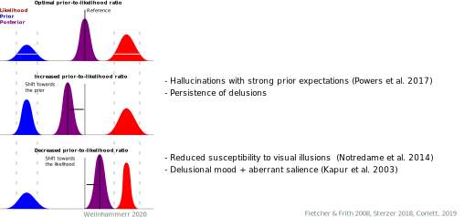

## Graded Ambiguity {data-background-color="black" data-transition="fade"}

<video loop data-autoplay data-src="./Content/Video_color_Lissajous.m4v" width="50%">

## Graded Ambiguity {data-transition="fade"}

 

## Simulation {data-background-image="./Content/Model_background.svg" data-background-size="contain" data-background-opacity="0" data-transition="fade"}

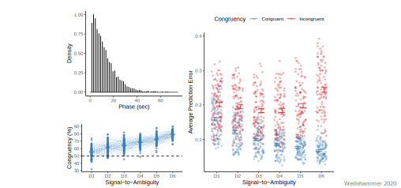

>- 23 patients (paranoid schizophrenia) & matched controls.
>- Matching: Age, Gender, handedness, 3D-vision.

## Group-level inference {data-background-image="./Content/Model_background.svg" data-background-size="contain" data-background-opacity="0" data-transition="fade"}

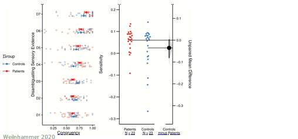

>- Group x Disambiguation - Interaction: F(6) = 2.52, p = 0.02
>- Higher sensitivity in patients

## Group-level inference {data-background-image="./Content/Model_background.svg" data-background-size="contain" data-background-opacity="0" data-transition="fade"}

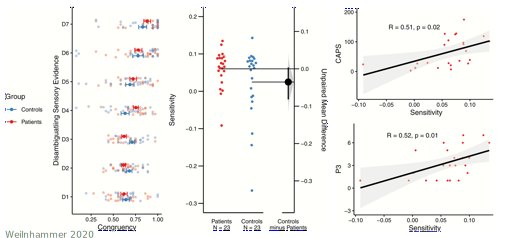

- Sensitivity ~ perceptual anomalies (CAPS) and hallucinations (PANSS-P3)

## Group-level inference {data-background-image="./Content/Model_background.svg" data-background-size="contain" data-background-opacity="0" data-transition="fade"}

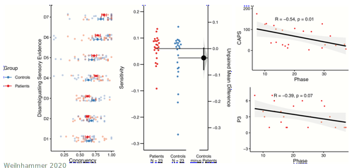

- 1/Phase ~ perceptual anomalies (CAPS) and hallucinations (PANSS-P3)

## Prior-to-likelihood ratio {data-transition="fade"}

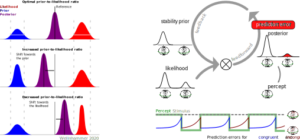

## Prior-to-likelihood ratio {data-transition="fade"}

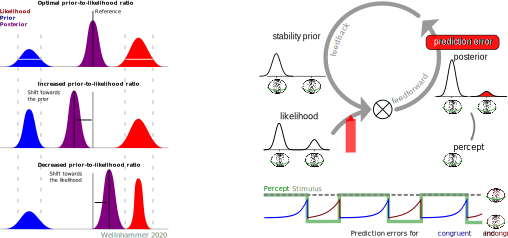

## Prior-to-likelihood ratio {data-transition="fade"}

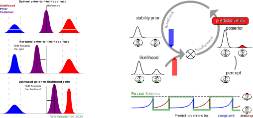

>- Sensitivity to perceptual conflicts ~ hallucinations

# Outlook {data-background-image="./Content/5_problems_outlook.svg" data-background-size="contain" data-background-opacity="0"}

## Altered states of consciousness {data-transition="fade"}

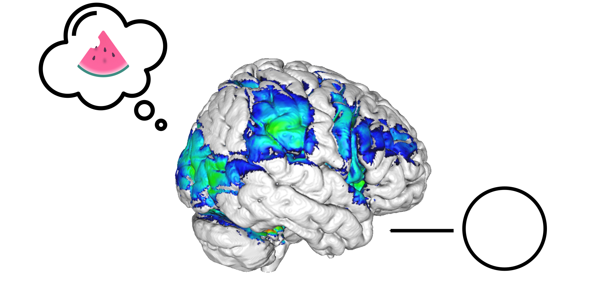

## Altered states of consciousness {data-transition="fade"}

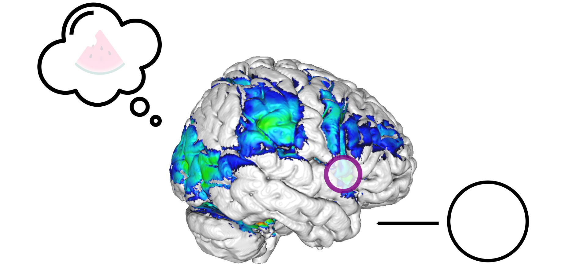

- Treating hallucinations with non-invasive brain stimulation in IFC?

# Thanks! {data-background-image="./Content/Thanks.svg" data-background-size="contain" data-background-opacity="0"}

# {data-background-iframe="https://veithweilnhammer.github.io"}

## References

<!--    -->

<!--  How does visual perception deal with conflicting sensory information?  -->

<!--    -->

<!-- - Behavioral paradigms and computational modeling -->
<!-- - Functional imaging and virtual lesions -->
<!-- - Conflicting sensory information in paranoid schizophrenia -->

<!-- ## R Markdown -->

<!-- This is an R Markdown presentation. Markdown is a simple formatting syntax for authoring HTML, PDF, and MS Word documents. For more details on using R Markdown see <http://rmarkdown.rstudio.com>. -->

<!-- When you click the **Knit** button a document will be generated that includes both content as well as the output of any embedded R code chunks within the document. -->

<!-- ## Slide with R Code and Output {data-background-color="black"} -->

<!-- ## R Markdown {data-background-video="./Content/Video_1.wmv"} -->

<!-- This is an R Markdown presentation. Markdown is a simple formatting syntax for authoring HTML, PDF, and MS Word documents. For more details on using R Markdown see <http://rmarkdown.rstudio.com>. -->

<!-- When you click the **Knit** button a document will be generated that includes both content as well as the output of any embedded R code chunks within the document. -->

<!-- ## Slide with Bullets {data-background-image="./Content/RDK.gif"} -->
