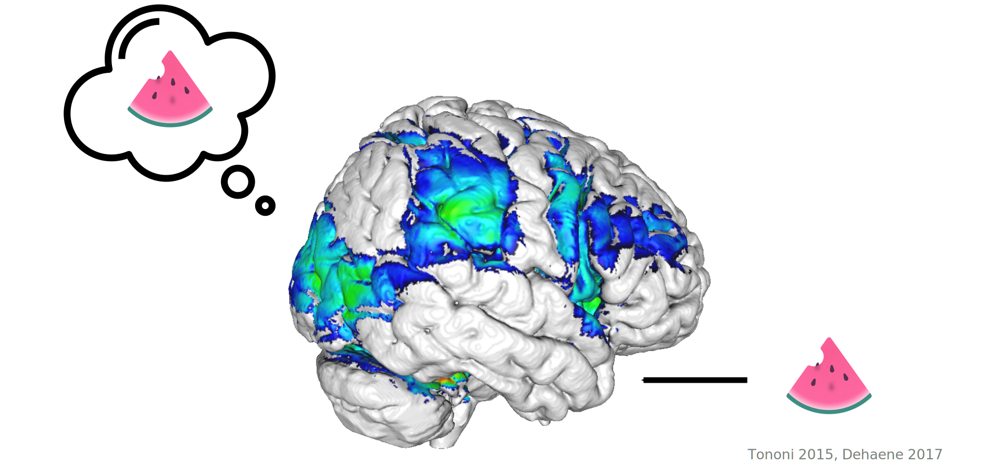
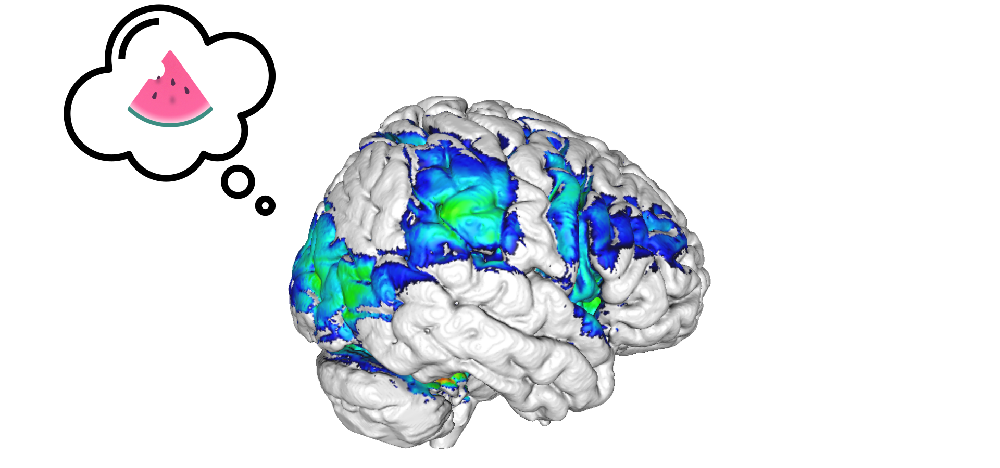
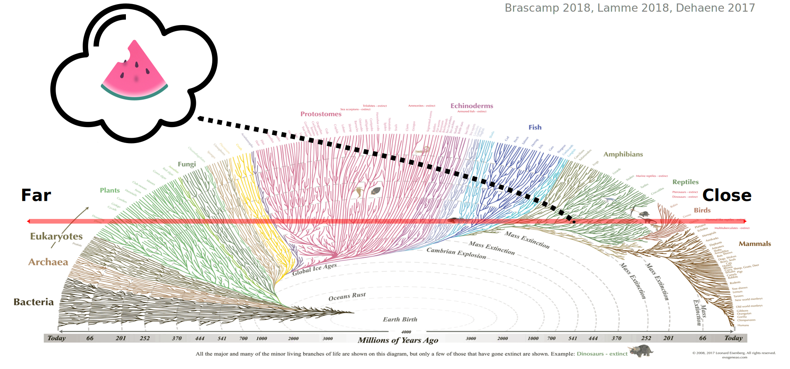
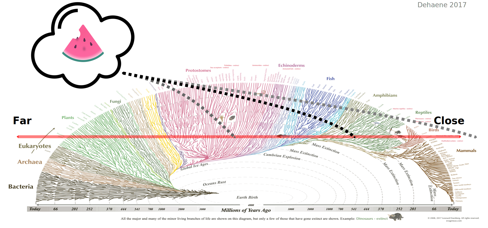
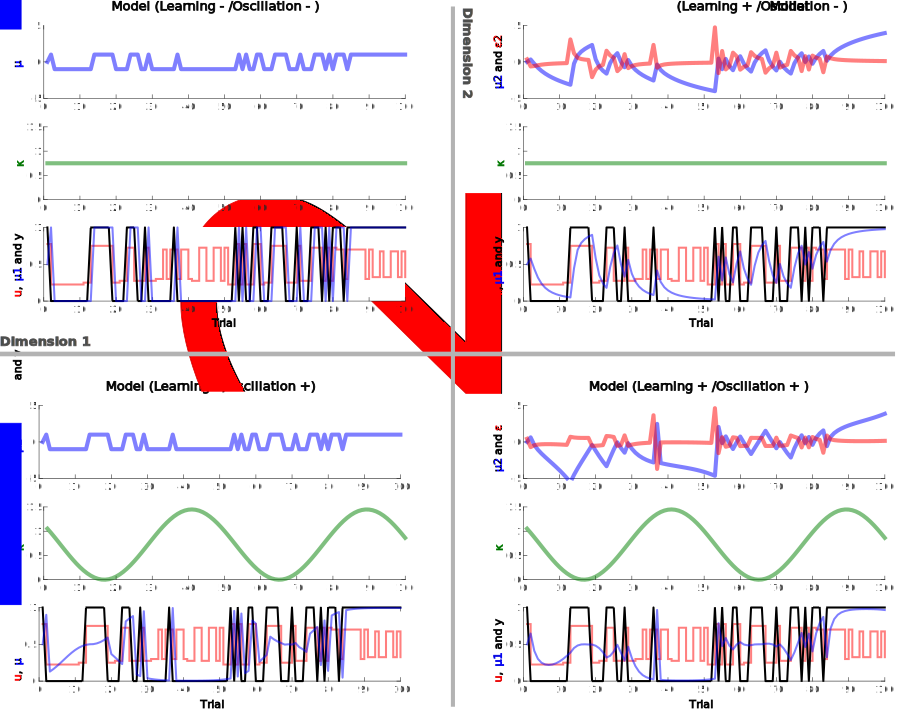

## Outline

<br/><br/><br/>

1. Five Problems in the Scientific Study of Consciousness
2. Bistable Perception and the Boundary Problem
3. Transparent, Reproducible and Fair Science

## Conscious Experience

<br/>
<br/>
<br/>

Nagel (1975): *"(...) an organism has conscious mental states if and only if there is something that it is like to be that organism — something it is like for the organism".* 


# Five Problems {data-background-image="./Content/5_problems.svg" data-background-size="auto 100%" data-background-opacity="0"}


## Subjectivity: The Hard Problem  {data-transition="fade"}



>- Why does conscious experience occur at all?


## Boundary {data-transition="fade"}



- What are the neural events jointly sufficient to generate conscious experience?


## Scale {data-transition="fade"}


- What is the scale at which conscious experience emerges from biological activity?


## Function {data-transition="fade"}



- What is the evolutionary function of conscious experience?


## Detection {data-transition="fade"}



- How can we detect conscious experience outside of the human mind?


# Five Problems {data-background-image="./Content/5_problems_highlight_Boundary.svg" data-background-size="auto 100%" data-background-opacity="0"}


## The neural correlates of consciousness {data-background-color="black"}


## The neural correlates of consciousness {data-background-color="black"}

<video data-autoplay data-src="./Content/Video_1.wmv">

## The neural correlates of consciousness {data-background-color="black"}

<video data-src="./Content/Video_1.wmv">

> - Behavioral paradigms and computational modeling

## The neural correlates of consciousness 


## Outline  {data-background-iframe="https://veithweilnhammer.github.io"}

<br/><br/>

<font size="100"> How does visual perception deal with conflicting sensory information? </font>
 
<br/><br/>

- Behavioral paradigms and computational modeling
- Functional imaging and virtual lesions
- Conflicting sensory information in paranoid schizophrenia

## R Markdown

This is an R Markdown presentation. Markdown is a simple formatting syntax for authoring HTML, PDF, and MS Word documents. For more details on using R Markdown see <http://rmarkdown.rstudio.com>.

When you click the **Knit** button a document will be generated that includes both content as well as the output of any embedded R code chunks within the document.


## Slide with Bullets



> - Bullet 1
> - Bullet 2
> - Bullet 3

##  {data-background-image="./Content/Models.png" data-background-size="auto 100%" data-background-opacity="0"}

> - Bullet 1
> - Bullet 2
> - Bullet 3


## Slide with R Code and Output {data-background-color="black"}

```{r, echo = TRUE}


## global Settings 
do_permutation = FALSE


knitr::opts_chunk$set(echo = FALSE, message = FALSE, warning = FALSE)
options(scipen = -1, digits = 2)

library(pander)
panderOptions('round', 2)
panderOptions('keep.trailing.zeros', TRUE)

 library(knitcitations); cleanbib()
  cite_options(citation_format = "pandoc", check.entries=FALSE)
  library(bibtex)
  
  
  library("RColorBrewer")
  display.brewer.pal(n = 8, name = 'Dark2')
  brewer.pal(n = 8, name = 'Dark2')
```

## Slide with Plot
```{r, echo=FALSE}
plot(cars)
```

<!-- ## R Markdown {data-background-video="./Content/Video_1.wmv"} -->

<!-- This is an R Markdown presentation. Markdown is a simple formatting syntax for authoring HTML, PDF, and MS Word documents. For more details on using R Markdown see <http://rmarkdown.rstudio.com>. -->

<!-- When you click the **Knit** button a document will be generated that includes both content as well as the output of any embedded R code chunks within the document. -->

<!-- ## Slide with Bullets {data-background-image="./Content/RDK.gif"} -->
